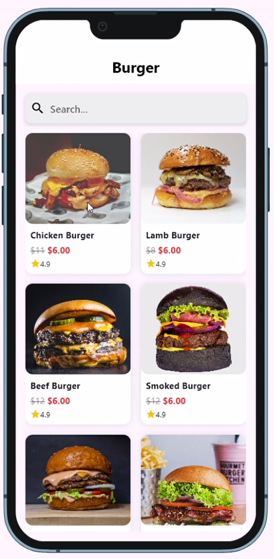
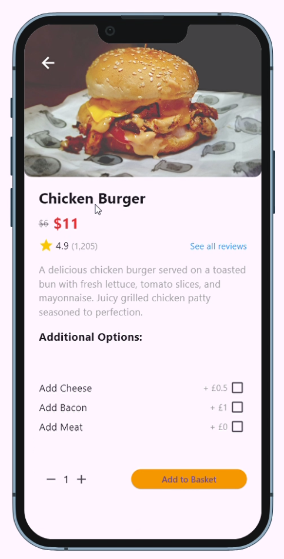
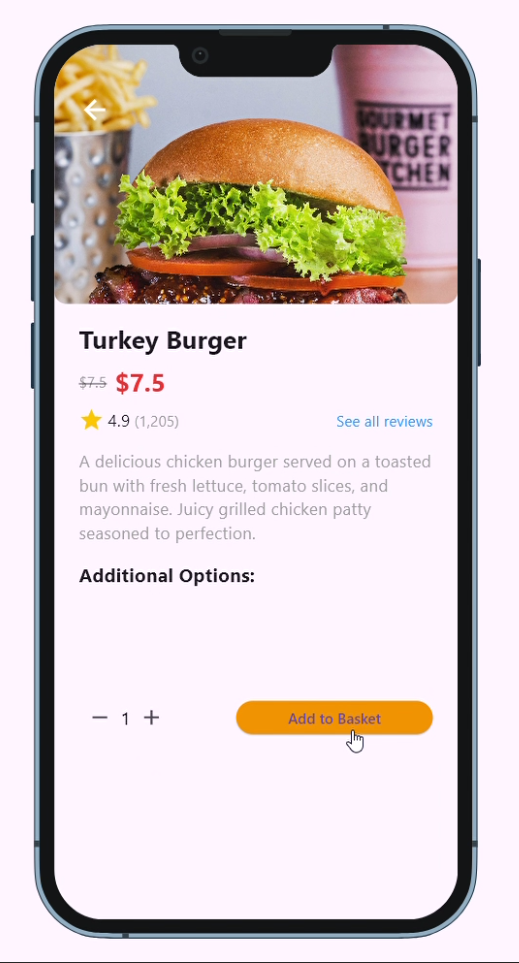
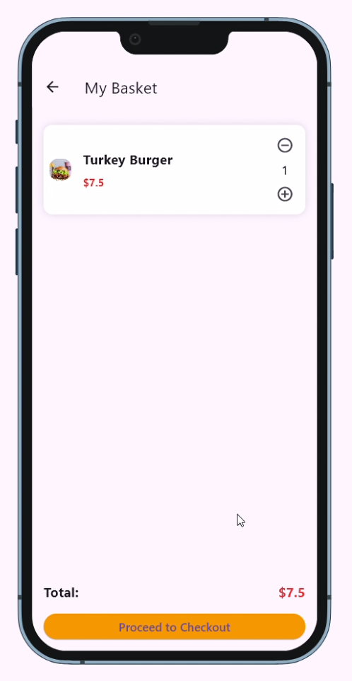
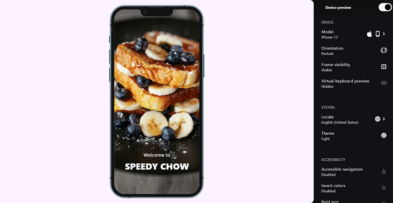

# Grocery App

A modern and feature-rich grocery shopping application built with Flutter, following clean architecture principles and best practices.

## 🚀 Features

- Clean Architecture implementation
- State Management using BLoC pattern
- Responsive UI design
- Cross-platform support (iOS, Android, Web)
- Offline support
- Modern UI with Shimmer effects
- Google Fonts integration
- Device preview support

## 📱 Screenshots






## 🎥 Demo Video

[Watch the demo video](https://drive.google.com/file/d/14yp1QdnKizqGQZSK3CiCiKxIqHwDwuQB/view?usp=sharing)  


## 🛠️ Technical Stack

- **Framework**: Flutter
- **Architecture**: Clean Architecture
- **State Management**: BLoC (Business Logic Component)
- **Dependency Injection**: GetIt
- **Networking**: HTTP
- **Local Storage**: SharedPreferences
- **Image Handling**: Image Picker
- **UI Components**:
  - Material Design
  - Cupertino Icons
  - Google Fonts
  - Shimmer Effects
- **Testing**:
  - Mockito
  - BLoC Test
  - Flutter Test

## 📦 Dependencies

- `dartz: ^0.10.1`
- `equatable: ^2.0.3`
- `flutter_bloc: ^8.0.1`
- `get_it: ^7.2.0`
- `http: ^0.13.3`
- `rxdart: ^0.27.3`
- `internet_connection_checker: ^1.0.0+1`
- `shared_preferences: ^2.3.1`
- `image_picker: ^1.1.2`
- `device_preview: ^1.2.0`
- `google_fonts: ^4.0.4`
- `shimmer: ^3.0.0`

## 🏗️ Project Structure

```
lib/
├── core/           # Core functionality and utilities
├── features/       # Feature-based modules
├── app.dart        # App configuration
├── main.dart       # Entry point
└── injection_container.dart  # Dependency injection setup
```

## 🚀 Getting Started

1. Clone the repository:
```bash
git clone [your-repository-url]
```

2. Navigate to the project directory:
```bash
cd grocery_app
```

3. Install dependencies:
```bash
flutter pub get
```

4. Run the app:
```bash
flutter run
```

## 🧪 Testing

Run tests using:
```bash
flutter test
```

## 📝 Requirements

- Flutter SDK: >=3.4.4 <4.0.0
- Dart SDK: Latest stable version
- Android Studio / VS Code with Flutter extensions


## 👥 Authors

[Kalkidan Kidane]

## 🙏 Acknowledgments

- Flutter Team
- BLoC Pattern
- All contributors and supporters